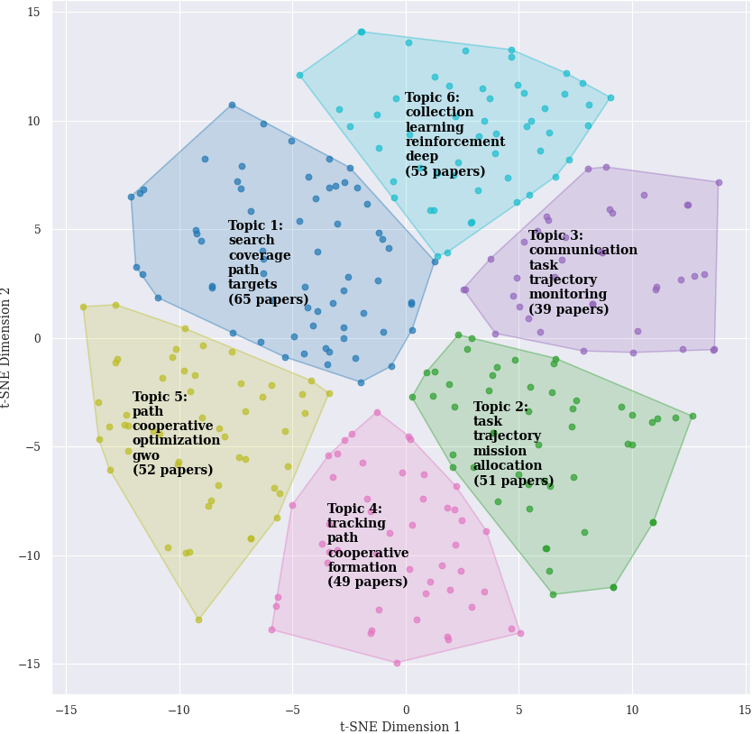

# A Systematic Literature Mapping of Cooperative and Collaborative Multi-UAV Motion Planning Approaches for UAVs

## Abstract
This study presents a Systematic Literature Mapping (SLM) on cooperative and collaborative motion planning for multi-unmanned aerial vehicles (UAVs). In this study, titles, abstracts, and keywords of 309 articles published between the years 2014 and 2024 were analyzed using natural language processing. It has identified six dominant research topics, analyzed the temporal trends showing a growing interest in the field, and highlighted some co-relation between the topics and future research opportunities, such as addressing coverage problems in dynamic and non-free environments. Thus, this SLM provides an overview of the field.

## Topics

## Selected papers
- [Selected papers PICOC score](papers_picoc_score.xlsx)
- [Selected papers file by topic](papers_by_topic.xlsx)

## cite us

FREITAS, Elias JR et al. A Systematic Literature Mapping of Cooperative and Collaborative Multi-UAV Motion Planning Approaches for UAVs.
